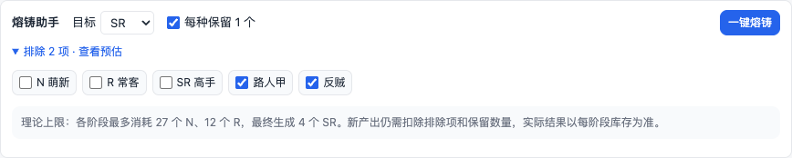

# LINUX SB 扩展工具箱

Chrome Manifest V3 扩展，提供称号统计、分阶段熔铸、Cloudflare R2 图片上传和可选广告隐藏。当前版本：**0.10.0**。运行时使用原生 JavaScript，不需要构建。

## 精简后的页面

**称号抽取页**默认只显示积分、收集进度和“更新数据”。详细流水、熔铸评价、库存与缺失称号默认折叠，展开后才生成内容；库存列表限制高度，避免把站点原有内容推到屏幕外。


**称号熔铸页**默认只显示目标 SR/SSR、每种保留一个和执行按钮，并放在站点称号 tab 栏的正下方、原生熔铸内容之前。排除称号与理论预估折叠展示；阶段进度、停止按钮和异常提示保持可见。




以上截图来自本机离线测试页面，使用模拟库存。界面取舍参考 [Laws of UX](https://lawsofux.com/) 中减少同时呈现的选项、降低认知负担和按需展开细节的原则。

## 功能与操作

- **更新数据**：获取最新积分与库存，再同步积分流水和熔铸通知。首次遍历全部可访问分页；已有完整历史且站点提供稳定记录 ID 时，在遇到已知记录页后停止增量扫描。缺少稳定 ID 时自动完整扫描，避免误判重复记录。
- **完整重建历史**：位于抽取页的“详细统计”内。重新遍历站点当前可访问的历史，成功后替换对应数据；某类记录获取失败时保留该类旧数据。通常使用普通“更新数据”即可保留本地已知历史。
- **统计范围**：详细统计显示上次同步时间、历史时间范围和完整性。“完整”指遍历站点当前可访问的历史，不代表站点已经删除的历史仍可恢复。
- **熔铸助手**：按 N→R→SR→SSR 分阶段执行。默认排除「路人甲」「反贼」并每种保留一个。预估明确标为理论上限，实际材料按各阶段当前库存重新计算。
- **阶段校验**：提交后保持“等待结果”，下一次页面载入核对实际材料消耗与目标稀有度增量，核对通过才进入下一阶段。库存变化不符合预期时暂停，不自动重试或继续消耗。
- **停止任务**：每阶段提交前有 3 秒停止窗口。停止只取消后续提交，已经提交的操作仍由站点处理。任务绑定账号和执行标签页，其他标签页不会接管执行；15 分钟后超时。关闭执行标签页后，可以在另一熔铸页停止原任务再重新发起。
- **预算保护**：最低余额与每次抽取确认集中在设置页。普通抽取只统计次数与积分投入；有完整通知的 SSR 熔铸结果才计算六级经验评价。
- **弹窗**：按“概况 → 更新 → 页面入口 → 辅助设置”的顺序布局；三个页面入口合并为一行，广告开关与更多设置放在底部工具栏，详细配置集中到设置页。

## 图床与广告

图床默认关闭，只在新建主题 `/topic_edit` 和帖子详情 `/topic/*` 中启用。支持选择、拖拽、粘贴图片，在浏览器本地压缩后上传并插入 Markdown 链接。

图床仅支持 Cloudflare R2，因此不再显示供应商选择框。填写账户 ID、Bucket、访问凭据和 HTTPS 公开访问域名后，选择推荐、高清或原图即可；对象前缀、具体压缩质量和最长边限制放在“高级设置”中。已有自定义参数会保留。清除凭据会同时关闭图床。

隐藏广告默认关闭，只隐藏论坛右侧广告卡片，不影响帖子、版块和热帖。弹窗与设置页的开关使用同一份设置。

称号模块只在 `/gacha` 和 `/gacha_forge_center` 注入；图床脚本只匹配编辑与帖子页；广告隐藏脚本匹配论坛页面，开关关闭时不隐藏内容。

## 本地数据与升级

- 设置由后台串行处理并按字段更新；调整预算或广告开关不会覆盖熔铸偏好。
- 积分、库存、流水、通知和熔铸任务按账号隔离。账号从顶部账户区或个人侧栏的“我的积分／我的通知”等入口识别，不从帖子作者链接推测身份。
- 无法确认登录账号、页面结构或最新库存时会提示错误并保留旧数据。站点改版后可能需要更新解析规则。
- 旧版本中带用户编号的数据自动迁移；没有用户编号的旧数据保留为未归属备份，不自动分配给新账号。旧版未绑定账号/标签页的熔铸任务不会恢复。
- 清除统计只影响设置页显示的账号，保留其库存与积分；清除前已经启动的同步结果不会重新写回。
- 数据和图床配置保存在 `chrome.storage.local`。不保存密码或 CSRF 字段；R2 Secret 在后台用于签名，不发送到论坛页面。启用图床后主动选择的图片会发送到配置的 R2，公开图片不适合存放隐私内容。

## 加载与验证

1. 打开 `chrome://extensions` 并开启开发者模式。
2. 选择“加载已解压的扩展程序”，选择本目录。
3. 更新代码后，在扩展管理页重新加载扩展，再刷新已打开的论坛页面。

单元测试和 DOM 交互测试：

```bash
npm ci
npm test
```

完整浏览器验证（隔离的临时配置，不使用个人浏览器账号）：

```bash
npx playwright install chromium
npm run test:browser
```

也可通过 `PLAYWRIGHT_CHROMIUM_EXECUTABLE` 指向已有的 Chromium 测试浏览器。浏览器测试禁用 DNS 并拦截请求，以本地页面模拟库存、账号和提交结果，覆盖桌面/窄屏布局、真实扩展设置、熔铸成功/失败/停止和图床开关，不进行真实抽取、熔铸或上传。

## 后续扩展位置

- `lib/state.js`：共享默认值、账号快照、历史合并和消息接口。
- `lib/store-worker.js`：后台串行保存、迁移、账号隔离和熔铸任务状态转换。
- `lib/parser.js`：站点 DOM 解析、统计计算及材料规划。
- `lib/history.js`：分页发现、完整扫描与增量边界。
- `lib/forge.js`：熔铸阶段定义与库存结果校验。
- `content.js`：称号页交互、精简面板及流程协调。
- `background.js` / `image-host.js`：R2 签名上传与编辑框图片处理。

增加新设置时先在共享默认值中声明，调用局部更新接口；增加账号数据时通过后台存储接口保存，不在页面中整份覆盖状态。涉及提交材料的改动需要同时验证成功、失败、账号变化、多标签页和停止场景。
