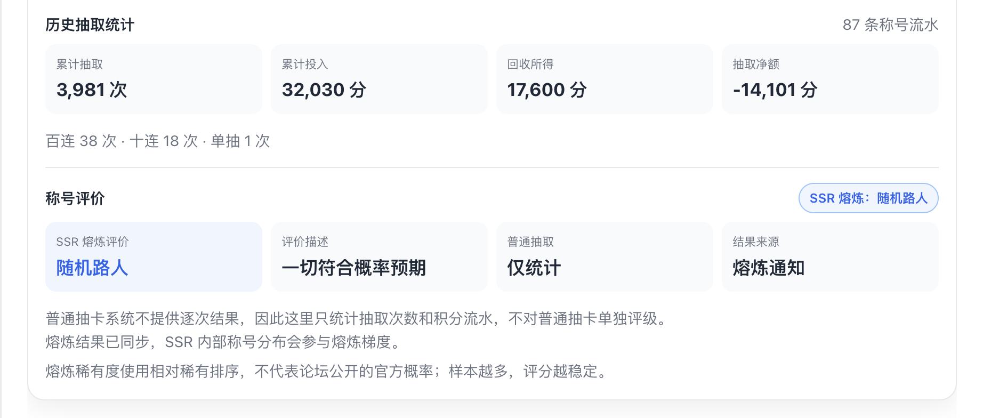
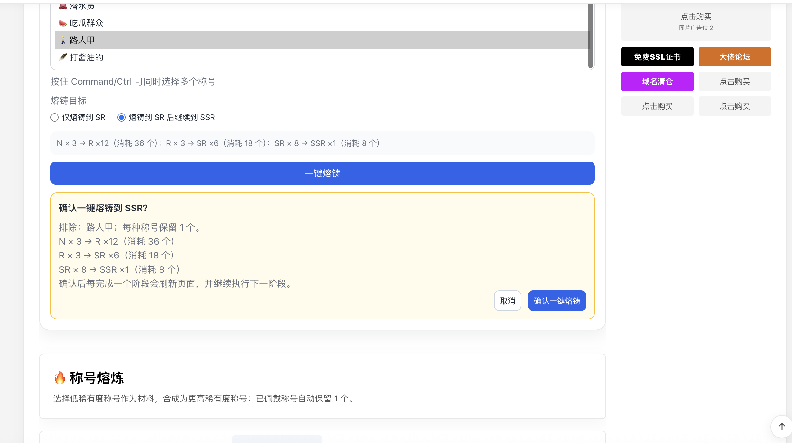
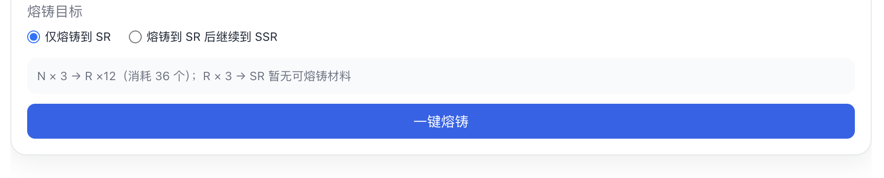
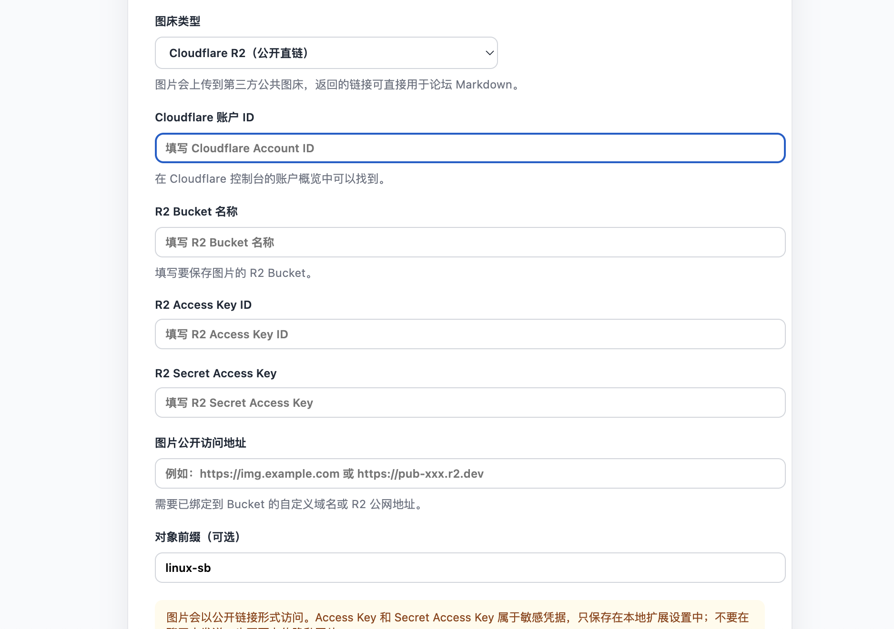

# LINUX SB 扩展工具箱

这是一个 Chrome Manifest V3 扩展工具箱，用于增强 `https://linux.sb/` 的个人称号抽取和称号熔炼页面。

称号模块只匹配 `/gacha` 和 `/gacha_forge_center`；图床模块只匹配 `/topic_edit`，且默认关闭。论坛首页、个人主页、积分页及其他页面不会默认注入。

当前 MVP：

- 读取称号抽取页的积分、称号池和收集进度。
- 读取个人称号页，显示当前库存和缺失称号。
- 从个人积分页统计单抽、十连、百连的次数与积分投入。
- 普通抽取只统计次数和积分流水；有完整通知的 SSR 熔炼结果使用天选之子、欧气成精、锦鲤转世、随机路人、保底受害者、非酋降临六级评价。
- 解析个人通知中的 N×3→R、R×3→SR、SR×8→SSR 熔炼结果，统计 SSR 内部称号分布。
- 在称号熔炼页提供一键熔铸：默认排除 N「路人甲」，可选择每种称号保留 1 个，并选择熔铸到 SR 或继续到 SSR。
- 提供默认关闭的 Cloudflare R2 图床助手：在发帖页选择、拖拽或粘贴图片后，自动上传并插入 Markdown 图片链接。
- 提供最低余额保护和单次抽取确认。

## 功能截图

### 抽取画像与称号评价



普通抽取只记录次数和积分流水；只有论坛通知中存在完整熔炼结果时，才会计算熔炼评价和 SSR 分布。

### 称号熔铸助手



熔铸助手按 N→R→SR→SSR 的顺序分阶段执行，支持多选排除项、每种称号保留一个，以及仅熔铸到 SR 或继续到 SSR。



预览会明确显示各稀有度的预计消耗数量和生成结果。

### Cloudflare R2 图床配置



图床默认关闭。启用后，在 `https://linux.sb/topic_edit` 的正文框中选择、拖拽或粘贴图片，即可上传到已绑定公开域名的 R2 Bucket，并在当前光标处插入 Markdown 图片链接。

统计数据和图床配置使用 `chrome.storage.local` 保存在本地，不上传账号信息，也不读取或保存密码、CSRF 值。图床助手只有在用户主动启用后才会把用户选择的图片发送到 Cloudflare R2；公开图床不适合上传隐私图片。

图床需要配置 R2 Bucket、R2 Access Key ID、Secret Access Key，以及已绑定到 Bucket 的 HTTPS 公共访问地址。上传使用 R2 的 S3 兼容签名请求；Secret Access Key 只在扩展后台使用，不注入论坛页面。

## 本地验证

```bash
npm test
```

## 在 Chrome 中加载

1. 打开 `chrome://extensions`。
2. 开启右上角“开发者模式”。
3. 点击“加载已解压的扩展程序”。
4. 选择本目录。
5. 回到 `https://linux.sb/gacha`，刷新页面。

插件不会自动连续提交抽取请求；需要用户明确确认后才会放行单次站点抽取。熔炼助手会在用户确认后按 N→R→SR→SSR 顺序逐阶段提交。

抽取评分使用称号池公布的稀有度概率；熔炼评分使用相对稀有排序。论坛没有公开完整的 SSR 具体称号概率，因此熔炼评分会标注为经验评分，富可敌国的零样本不会被当成零概率。
